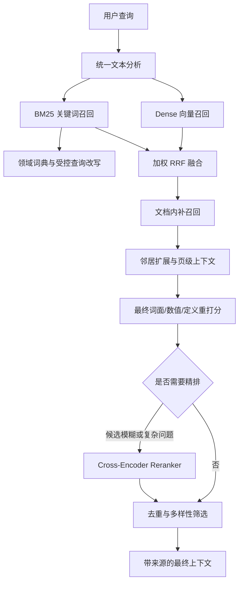

---
tags:
  - RAG
  - 检索
  - BM25
  - 评测
  - 项目总结
---

# Day4：检索优化与验收总结

## 1. 当前项目定位

这是一个面向本地知识库的 RAG 系统，目标不是只返回“语义相近”的文本，而是为回答提供可核验、带文档和页码来源的证据。

系统当前已经进入稳定可用阶段：检索核心、质量门控、评测闭环和性能降级策略均已实现，并通过 dev 与 test 验收。

## 2. 当前检索链路



### 2.1 核心模块

| 模块 | 职责 |
| --- | --- |
| `src/retrieval/text_analyzer.py` | 统一文档与查询的归一化、分词、领域词典和受控改写。 |
| `src/retrieval/bm25_index.py` | 维护独立 BM25 关键词索引，过滤零分候选。 |
| `src/retrieval/first_stage.py` | Dense 与 BM25 召回、加权 RRF 融合、首轮候选评分。 |
| `src/retrieval/document_recall.py` | 在高分文档中补召回，并扩展相邻 chunk。 |
| `src/retrieval/final_selector.py` | 最终轻量重打分、条件精排、去重和上下文多样性控制。 |
| `src/retrieval/reranker.py` | 本地 Cross-Encoder 精排器，支持离线模型与预加载。 |
| `src/services/ingestion.py` | 解析、质量门控、OCR 回退、分块、向量化和入库。 |

### 2.2 当前默认策略

- Dense：`BAAI/bge-small-zh-v1.5`。
- BM25：使用统一 `TextAnalyzer`，不再使用 jieba 的默认独立切词结果。
- 融合：`rrf_weighted`。
  - 型号、标准号、数值类问题提高 BM25 权重。
  - 定义、解释类问题提高 Dense 权重。
- 最终筛选：综合词面覆盖、锚点、连续短语、定义条目和数值答案形态。
- page-context：短页被切散时保留整页候选，最终最多保留 2 个。
- Reranker：CPU 在线链路默认关闭；需要时仅对候选接近或复杂问题启用，最多精排 12 条候选。

## 3. 主要问题与解决方案

### 3.1 Retriever 职责过多

**问题**：原 `Retriever` 同时承担 BM25、融合、文档补召回、邻居扩展、最终筛选和精排，难以定位质量问题。

**解决**：拆分为首轮召回、文档补召回、最终选择等独立模块；`Retriever` 只保留统一入口和兼容 API。

**收益**：每一阶段都可以独立测试、替换和诊断。

### 3.2 BM25 分词和 chunk 不一致

**问题**：文档中的 `E VAC`、`GB/Z 185.4`、`20 至 50 毫秒` 与查询中的 `E-VAC`、`GB/Z185.4`、`20~50ms` 无法稳定对齐，导致 BM25 可能无命中或得到零分。

**解决**：

- 文档和查询都走 `TextAnalyzer`。
- 统一型号、标准号、范围、单位和连字符形式。
- BM25 对零分候选直接过滤，不再把无关候选送进 RRF。

**收益**：关键词检索成为稳定的精确召回通道，不再被 Dense 单独主导。

### 3.3 专业别名和字段名无法命中

**问题**：用户可能输入“智能体 ID”“跳闸”“工作电压”，而文档中使用 `agentId`、“分闸”“额定电压”。

**解决**：在 `config/default.yaml` 的 `retrieval.bm25` 中配置：

- `domain_terms`：将别名映射到规范词，例如 `智能体 ID` 与 `agentId`。
- `query_rewrites`：只对高置信触发词扩展，例如“跳闸 -> 分闸”。

最终重打分也复用同一分析器，避免“BM25 已命中，最终选择又因原始词不同而丢弃”的规则分叉。

**消融结果**：新增 5 条别名用例中，关闭查询改写时最终命中为 `4/5`；开启后为 `5/5`，最终上下文精度从 `0.32` 提升到 `0.36`。

### 3.4 跨 chunk 证据被切散

**问题**：同一页面中的 `APG 工艺`、`真空灭弧室`、`固封` 可能被分到不同 chunk，单个 chunk 无法提供完整答案证据。

**解决**：对短页且被切成多个 chunk 的情况，额外生成 `page_context` 整页上下文 chunk。

**治理**：

- 每个 chunk 都带 `chunk_type`，区分 `content` 和 `page_context`。
- 类型会保存到向量元数据和 SQLite。
- 最终结果最多保留 2 个 `page_context`，避免整页块挤占精确内容块。

### 3.5 已召回证据被最终筛选丢弃

**问题**：`dev_evac_001` 中温度范围的证据已经进入扩展候选池，但没有进入最终 top-k。

**解决**：提高“语义字段 + 数值单位/范围”答案的最终加分，并修正 page-context 的数量限制。

**收益**：最终选择不再只偏向高基础分 chunk，能保留真正回答数值问题的证据。

### 3.6 Reranker 的效果与性能矛盾

**问题**：本地 `bge-reranker-base` 可以正确工作，但 CPU 精排使 smoke 全量运行从约 `97 秒` 增加到约 `527 秒`，而当前 smoke 指标没有提升。

**解决**：

- 支持本地离线模型、`local_files_only` 和预加载。
- CPU 默认不启动 reranker。
- 启用后仅在候选分差小或查询复杂时精排。
- 候选池限制为 12 条。

**结论**：当前 reranker 保留为可选能力；GPU 环境或复杂查询场景更适合开启。

### 3.7 PDF 解析和 OCR 风险

**问题**：扫描件、字体编码异常或复杂 PDF 可能解析为空文本、乱码或低可读文本。

**解决**：新增 `src/parsing/quality_gate.py`，检查：

- 总文本字符数。
- 可读字符比例。
- 显式乱码比例。

当混合解析不达标时，入库流程自动尝试全页 OCR；只有 OCR 结果质量更高时才替换原结果。

## 4. 评测体系

### 4.1 数据集划分

| 数据集 | 用途 | 当前数量 |
| --- | --- | ---: |
| smoke | 快速回归 | 8 |
| dev | 调参与诊断 | 23 |
| test | 留出验收，不参与调参 | 13 |

新增用例覆盖：产品别名、单位表达、字段名别名、数值参数、表格、定义、跨页/页级上下文和负样本。

### 4.2 诊断阶段

检索诊断报告会分别检查：

1. `first_stage`：Dense + BM25 + RRF 的首轮召回。
2. `doc_internal`：高分文档内的补召回。
3. `expanded`：邻居和页级上下文扩展。
4. `final`：最终筛选或精排后的上下文。

这使问题能够被明确归类为“解析失败、首轮漏召回、扩展失败、最终筛选丢失或负样本不安全”。

## 5. 最终验收结果

### 5.1 自动化检查

- 单元测试：`41 passed`。
- 数据集契约：通过。
- 所有严格检索证据都带页码锚点：`37/37`。

### 5.2 检索验收

| 数据集 | 结果 | 说明 |
| --- | --- | --- |
| dev | `23/23` 通过 | 20 个正样本命中，3 个负样本安全。 |
| test | `13/13` 通过 | 11 个正样本命中，2 个负样本安全。 |

相关报告：

- `eval/reports/dev_bm25_alias_no_rewrite.json`
- `eval/reports/dev_bm25_alias_with_rewrite.json`
- `eval/reports/retrieval_diagnostics_dev_final.json`
- `eval/reports/retrieval_diagnostics_test_final.json`

## 6. 常用命令

```powershell
# 全量单元测试
.\.venv\Scripts\python -m pytest -q

# 校验数据集格式、文档引用和 dev/test 隔离
.\.venv\Scripts\python eval\validate_dataset.py

# dev 检索诊断，不启用 reranker，验证基础链路
.\.venv\Scripts\python eval\run_retrieval_diagnostics.py --dataset dev --no-reranker --no-ocr-fallback --default-report

# test 留出集验收
.\.venv\Scripts\python eval\run_retrieval_diagnostics.py --dataset test --no-reranker --no-ocr-fallback --default-report

# 对照查询改写：临时关闭受控改写
$env:RETRIEVAL__BM25__ENABLE_QUERY_REWRITE='false'
.\.venv\Scripts\python eval\run_retrieval_diagnostics.py --dataset dev --no-reranker --default-report
Remove-Item Env:RETRIEVAL__BM25__ENABLE_QUERY_REWRITE
```

## 7. 当前项目边界与后续维护

当前核心工程任务已经完成，后续不需要继续大规模重构。维护重点为：

1. 新增真实文档时检查解析质量报告，必要时启用 OCR 或 Marker。
2. 根据真实用户查询补充高置信领域词典和对应 dev 用例。
3. 每次调参先运行 dev，再用 test 做最终验收；不要根据 test 调参数。
4. 有 GPU 或复杂查询需求时，再开启条件 reranker 并记录时延和收益。
5. 数据规模明显增长后，基于评测结果选择 IVF 或 HNSW 替代 Flat 索引。

## 8. GitHub 版本演进复盘

本节以仓库 `lingye999/rag-knowledge-base` 的提交记录为依据，记录项目从原型到可验收系统的演进。这里的版本不是简单的功能清单，而是每次改动所回应的真实工程问题。

| 阶段 | 时间与关键提交 | 当时的重点 | 主要产出 |
| --- | --- | --- | --- |
| 原型建立 | 2026-07-14，`0099d2b` | 先验证本地知识库的最小闭环 | 文档加载、BGE 向量化、FAISS Flat/IVF/HNSW 与命令行检索。 |
| 稳定性补齐 | 2026-07-15，`a6c1919` | 处理真实文件输入的失败路径 | PDF/DOCX 异常保护、空内容检测、编码识别、IVF 初始化修复、英文分句。 |
| 混合检索与问答 | 2026-07-16，`09119e3`、`b11f6af` | 解决纯 Dense 对精确词不稳、扫描 PDF 无文本的问题 | Dense + BM25 + RRF，EasyOCR 兜底、文本清洗、LLM 回答与 OCR 优先模式。 |
| 职责拆分与检索升级 | 2026-07-17，`cb31e23`、`cda77cb`、`c55b5ae` | 解决脚本膨胀、数据重复持有、检索链难排查的问题 | `src` 分层、入库服务、统一 Retriever、文档级召回、查询改写和端到端测试。 |
| 解析质量与精排 | 2026-07-19，`b5ce086` | 处理复杂 PDF、首轮候选排序不够精确的问题 | Marker 解析通道、Cross-Encoder reranker、P0 修复。 |
| 存储与架构收敛 | 2026-07-20，`72a08a9` | 解决索引持久化、删除与质量分散在多处的问题 | SQLite 持久化、统一向量库基类、动态质量评分和检索链整理。 |
| 可配置、可观测、可评测 | 2026-07-21，`26521db`、`1d814b2`、`7fd100b` | 解决参数散落、PDF 质量不可见、密钥泄漏风险和评测不可复现的问题 | YAML 配置中心、结构化日志、混合 PDF 读取、早期评测框架、环境变量读取 API Key。 |
| 严格证据验收 | 2026-07-22 至 2026-07-23，`630c69e`、`38dd9dd` | 防止“看起来命中”却无法回答，避免用测试集调参 | 带页码锚点的数据集、负样本、解析检查、检索诊断、生成质量评测、smoke/dev/test 隔离。 |

### 8.1 演进主线


这条演进说明项目的核心重心已经发生变化：早期关注“是否能检索到内容”，中期关注“能否稳定处理真实文档”，当前关注“返回的内容是否是可定位、可验证、能支持回答的证据”。

## 9. 问题、根因、方案与工程经验

| 问题 | 根因 | 对应解决方案 | 工程经验 |
| --- | --- | --- | --- |
| PDF/DOCX 导入报错、空文本或乱码 | 文件编码、扫描件、字体映射和复杂布局不受简单文本提取控制 | 异常保护、编码检测、EasyOCR、混合逐行 OCR、Marker 通道、解析质量门控 | 解析质量是检索质量的前置条件；不能把解析失败伪装成检索失败。 |
| IVF 在小数据集或未训练状态下异常 | 索引类型的训练前置条件未被封装 | 修复 IVF 初始化与训练流程，保留 Flat/HNSW/IVF 可切换实现 | 索引算法的适用规模和生命周期必须进入实现与测试，而不只是配置项。 |
| 纯 Dense 对型号、标准号、数值范围不稳定 | 语义向量会弱化稀有符号、精确字符串与单位表达 | 引入 BM25 与 RRF，当前按查询类型采用加权 RRF | Dense 与 BM25 是互补召回路；融合应依据查询特征，而不是固定相信其中一路。 |
| BM25 有时“无命中”或只产生零分 | 文档 chunk 与查询使用不同切词、连字符、空格、单位和别名形式 | `TextAnalyzer` 同时处理文档与查询；统一归一化、领域词典和受控改写；过滤零分候选 | 统一应发生在建立 BM25 语料与分析查询之前，不能只在某一端补丁式处理。 |
| BM25 已召回，最终结果仍遗漏答案 | 首轮、扩展、最终重打分使用的词面规则不同；page 级证据被切散 | 最终选择复用分析规则；文档内补召回、邻居扩展与 `page_context` | 检索链各阶段必须共享语义约定，并用阶段诊断定位证据在哪一步丢失。 |
| 混合检索器和向量库重复维护数据 | 早期组件各自持有向量/文本状态，所有权边界不清 | Retriever 只维护检索逻辑，向量库集中管理数据；后续引入仓储与索引服务 | 数据必须有单一事实来源，索引是可重建派生物而非第二份业务数据。 |
| 向量持久化、删除、重建容易不一致 | 内存索引、元数据和删除状态没有统一存储契约 | SQLite 保存向量与元数据，FAISS 可由数据库重建，删除状态纳入统一基类 | 先定义持久化和重建契约，再增加索引类型；否则每种索引都会产生独立故障模式。 |
| Reranker 可以使用但 CPU 延迟过高 | Cross-Encoder 对每个 query-document 对逐一推理，成本远高于双塔召回 | 本地离线加载、预加载、候选上限与条件启用；CPU 默认关闭 | 精排不是默认越多越好，应以增益、延迟和硬件条件共同决定是否启用。 |
| 早期测试只能证明程序运行，不能证明答案可靠 | 测试查询缺乏来源锚点、负样本和独立验收集 | 结构化评测集、页码/锚点证据合同、解析检查、检索分阶段报告、dev/test 隔离 | RAG 的验收对象是“证据是否正确被取回”，不是只看最终文本是否流畅。 |
| 配置和密钥散落在代码中 | 原型阶段直接写死参数与服务凭据 | YAML 配置中心、环境变量读取 `DEEPSEEK_API_KEY`、依赖分层 | 外部服务、模型与阈值必须可配置；密钥必须从代码与提交历史中移除。 |

### 9.1 当前问题定位方法

出现新问题时，按下面顺序排查，避免直接调整权重：

1. 检查原文件和解析质量报告，确认目标事实没有在解析阶段丢失。
2. 检查分块与页码元数据，确认答案没有被不合理地切断。
3. 查看 `first_stage` 诊断，区分 Dense 漏召回、BM25 零分或融合排序问题。
4. 查看文档内补召回和邻居扩展，确认相关 chunk 是否进入候选池。
5. 查看 `final` 诊断，确认最终筛选、去重或 reranker 没有丢弃正确证据。
6. 将该问题固化为 dev 用例；验证通过后再用不参与调参的 test 集验收。

## 10. 借鉴资料与采用边界

下表区分了项目明确引用的思路、直接使用的组件以及本项目自己的工程实现。它们是参考和依赖关系，不表示直接复制了外部项目的实现代码。

| 资料或组件 | 项目中的采用方式 | 可追溯证据 | 采用边界 |
| --- | --- | --- | --- |
| [FAISS](https://github.com/facebookresearch/faiss) | 使用 Flat、IVF、HNSW 近邻索引；以 SQLite 数据重建索引 | README 的向量存储说明；初始版本 `0099d2b` | FAISS 负责向量近邻搜索，不负责文档解析、分块或业务元数据治理。 |
| [BAAI BGE](https://huggingface.co/BAAI/bge-small-zh-v1.5) | 使用 `bge-small-zh-v1.5` 生成 Dense 向量；可选 `bge-reranker-base` 精排 | README 与 `src/services/embedding.py`、`src/retrieval/reranker.py` | 模型提供表示能力，不替代关键词精确匹配和评测。 |
| BM25 与 RRF | 使用稀疏关键词召回与基于名次的融合；当前增加查询类型权重 | Day1 混合检索提交 `09119e3`；当前检索配置与实现 | RRF 不直接比较不同通道的原始分数；加权只在有领域用例和对照评测支持时启用。 |
| [EasyOCR](https://github.com/JaidedAI/EasyOCR) | 扫描 PDF 或检测到乱码区域时作为 OCR 回退 | Day1-2 提交 `b11f6af`；解析模块 | OCR 结果仍需清洗与质量比较，不能因为 OCR 成功调用就默认可信。 |
| [Marker](https://github.com/VikParuchuri/marker) | 为复杂排版、表格或论文提供可选的高质量 PDF 转 Markdown 通道 | 提交 `b5ce086`；`marker_reader.py` | 属于较重的可选依赖，受 GPU 和本地模型条件限制，不作为所有 PDF 的默认路径。 |
| [RAGFlow DeepDoc](https://github.com/infiniflow/ragflow) 思路 | 参考逐行质量判断后选择性 OCR 的混合 PDF 读取策略 | README 明确标注“参考 RAGFlow DeepDoc 思路”；`hybrid_reader.py` 注释 | 参考的是质量判定与回退策略，本项目保留轻量本地实现，并未宣称复用 DeepDoc 完整管线。 |
| [LangChain](https://github.com/langchain-ai/langchain) / [LlamaIndex](https://github.com/run-llama/llama_index) | 参考 chunk 大小和重叠比例等参数约定 | README 的分块策略说明 | 仅借鉴参数表达与经验范围，分块、入库与检索实现由本项目维护。 |
| OpenAI 兼容接口 / DeepSeek | 作为可替换的生成与查询改写服务，密钥由环境变量注入 | `1d814b2`、`7fd100b` 的安全修复；服务模块 | 生成结果不作为检索正确性的唯一依据，必须受来源证据约束。 |

### 10.1 可复用的方法论

1. 先建立最小可用链路，再由真实失败样本推动健壮性和架构改造。
2. 把解析、召回、融合、筛选、精排拆成可独立观测的阶段，避免用一个总分掩盖失败位置。
3. 对领域系统，词典和查询改写必须是受控配置，并以消融实验确认收益。
4. 对每一次质量优化，同时记录指标收益、失败样例与延迟成本；没有对照评测的“优化”不能作为默认策略。
5. 将文档来源、页码和锚点视为产品输出的一部分，使检索结果可以复核、纠错和持续迭代。
